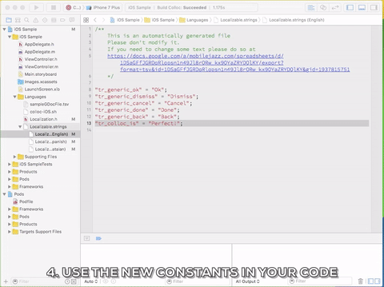
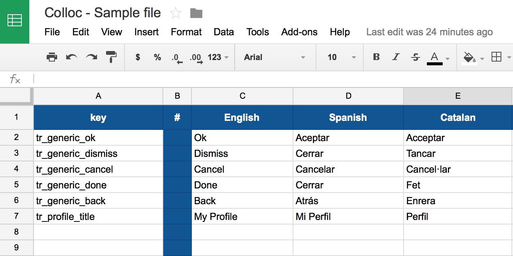

# Colloc: COLaborative LOCalizations for iOS & Android

Need to localize all strings in a project? Are you going to build the same App both for iOS & Android? This means 2*(number_languages) and can grow pretty quick.

Wouldn't you like a simpler way to do this, while collaborating with your users, customers & team? Enter Colloc.

Colloc is a collaborative platform to manage the localizations for iOS and Android using a Spreadsheet.

You can see Colloc in action [here](doc/inaction.md)

## Using Colloc is really simple

### 1. Install Colloc

- just download [the script]((https://github.com/mobilejazz/Colloc/blob/master/colloc.php)) and [run it](doc/run.md) from the command line.
- install in an iOS project using CocoaPods

Read more about installing Colloc [here](doc/install.md)

### 2. Create a Spreadsheet containing all the text strings that need to be localized

Basically, you can define all the localization strings of your project in a user-friendly spreadsheet document as it is shown in the image. In this case is a Google Doc Spreadsheet, but you can use a LibreOffice ODS file or Microsoft Excel XLS.

Then, by runing a script you can export all the strings for all languages to iOS and/or Android format.

Learn more about Colloc spreadsheet's simple format and download a template [here](doc/spreadsheet.md)

### 3. Export the spreadsheet to a TSV text file

A TSV (Tab Separated Values) is nothing more than a text file with all the columns of your spreadsheet separated by TABs.

Lear more about [exporting your spreadsheet to TSV](doc/tsv.md)

### 4. Run the Colloc script

You can run Colloc directly from the command line, or integrate in your projects. Learn more about how to [run](doc/run.md) Colloc.

## Code Samples

You can find working samples in the [samples folder](Sample Projects)

## Language Support

Currently, Colloc only supports the following languages:

| Language   | ISO639 |
|------------|--------|
| English    | en     |
| Spanish    | es     |
| Catalan    | ca     |
| German     | de     |
| French     | fr     |
| Italian    | it     |
| Portuguese | pt     |
| Dutch      | nl     |
| Swedish    | sv     |
| Arabic     | ar     |
| Polish     | pl     |
| Portuguese | pt     |
| Russian    | ru     |
| Turkish    | tr     |
| Chinese    | zh     |
| Greek      | el     |
| Japanese   | ja     |

To use colloc with a different language, just use in the first row of the language-column the ISO639 language code (colloc translates the Language name to the ISO630 if available, otherwise uses the available language name as the language code).

---
## License

Copyright 2015 Mobile Jazz SL

Licensed under the Apache License, Version 2.0 (the "License");
you may not use this file except in compliance with the License.
You may obtain a copy of the License at

http://www.apache.org/licenses/LICENSE-2.0

Unless required by applicable law or agreed to in writing, software
distributed under the License is distributed on an "AS IS" BASIS,
WITHOUT WARRANTIES OR CONDITIONS OF ANY KIND, either express or implied.
See the License for the specific language governing permissions and
limitations under the License.
